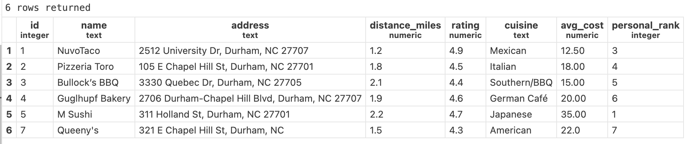
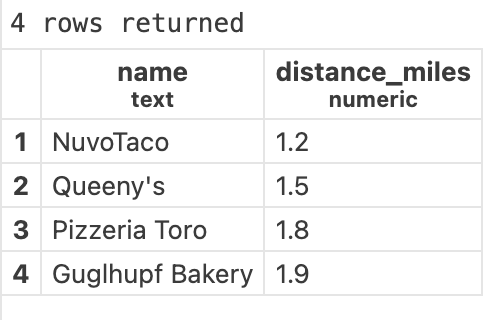
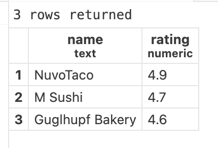
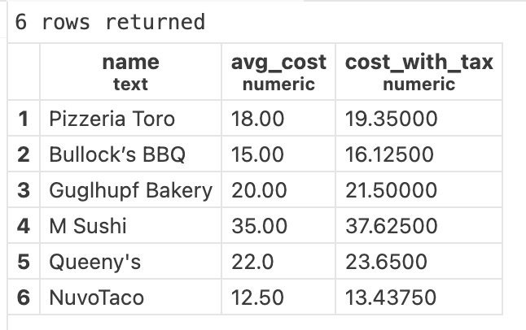
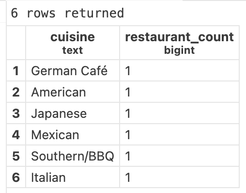
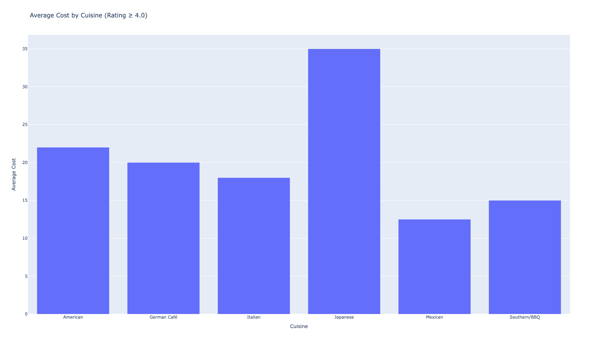

# IDS706_Data-Engineering_PostgreSQL

A tiny PostgreSQL project using the **duke_restaurants** dataset.  
This repo shows **4 SQL tasks** with **side-by-side results** and is fully reproducible with VS Code Dev Containers / Docker.

## Dataset & Schema
Table: **restaurants**

| column          | type     | meaning                         |
|-----------------|----------|---------------------------------|
| id              | serial   | primary key                     |
| name            | text     | restaurant name                 |
| address         | text     | street address                  |
| distance_miles  | numeric  | distance from campus (miles)    |
| rating          | numeric  | rating (0–5)                    |
| cuisine         | text     | cuisine type                    |
| avg_cost        | numeric  | average cost ($)                |
| personal_rank   | int      | personal preference ranking     |



## SQL Queries & Outputs
#### Q1: Return name, distance_miles for restaurants within 2.0 miles, ordered by distance.
```
select name, distance_miles
from restaurants
where distance_miles <= 2.0
order by distance_miles;
```


#### Q2: Show the top 3 restaurants by rating (highest first).
```
select name, rating
from restaurants
order by rating desc
limit 3;
```


#### Q3: List name, avg_cost and cost with 7.5% tax as cost_with_tax.
```
select name, avg_cost, (avg_cost * 1.075) as cost_with_tax
from restaurants;
```


#### Q4: How many restaurants are there per cuisine, highest count first?
```
select cuisine, count(*) as restaurant_count
from restaurants
group by cuisine
order by restaurant_count desc;
```


## Data Visualization: Average Cost by Cuisine (Rating ≥ 4.0)
Among restaurants with rating ≥ 4.0, compare the average cost across cuisines.
Finish through `scripts/data_visualization.py`.
